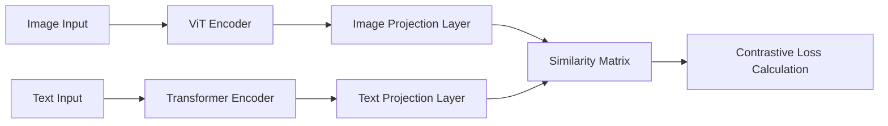
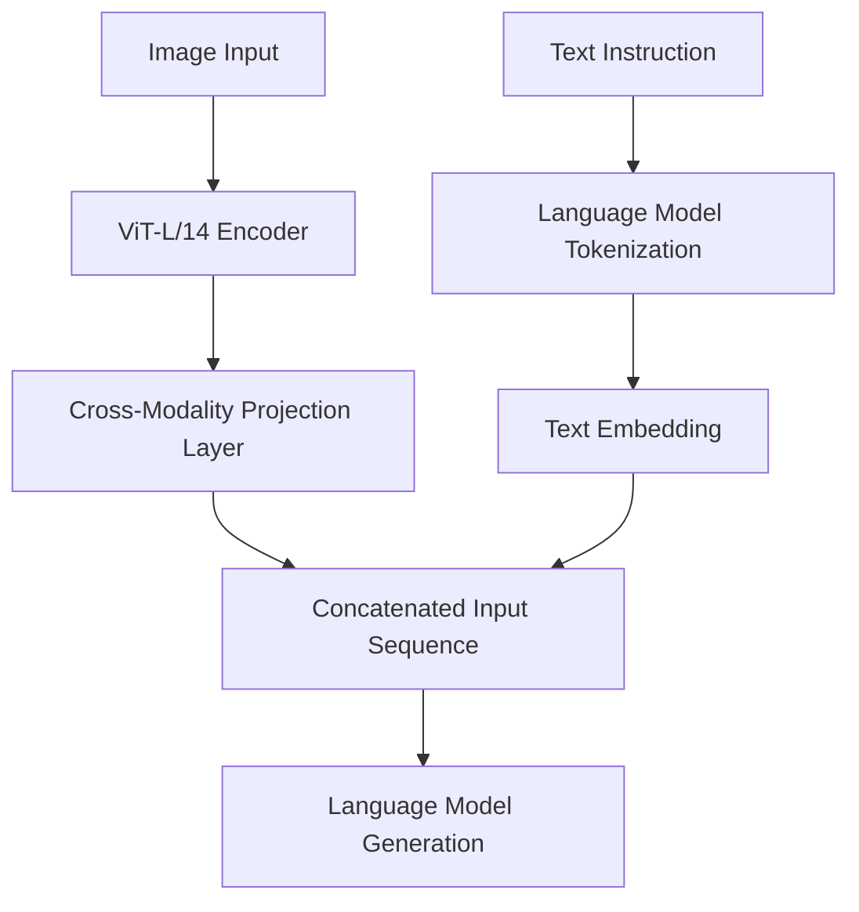

### Prerequisites

Regardless of the method, you need to first enter the corresponding model directory, create and activate a virtual environment, and download the dependencies from `requirements.txt`.

Example commands:

```bash
python3 -m venv venv
source venv/bin/activate
pip install -r requirements.txt
```


Use github to download the dataset in the root directory：

You are advised to use a mirror or connect to a foreign proxy or enable a vpn if  you in China.

```bash
git clone https://huggingface.co/datasets/mrzjy/AniPersonaCaps     
```

---

### CLIP Inference & Training Guide

#### I. Detailed Modeling Methods

##### 1. Contrastive Learning Paradigm

- **Core Idea**: Map images and texts to a shared embedding space, bringing matching pairs closer and non-matching pairs farther apart.
- **Implementation Steps**:
  1. **Dual-Modality Encoding**: Extract features using a visual encoder and a text encoder.
  2. **Projection Alignment**: Map features to a unified dimension using linear projection layers.
  3. **Similarity Calculation**: Use cosine similarity matrix for cross-modal matching.
  4. **Symmetric Loss**: Compute cross-entropy loss in both image-to-text and text-to-image directions.



##### 2. Data Preprocessing Strategies

- **Image Processing**:
  - Resize to 224x224.
  - Channel normalization (mean=[0.485, 0.456, 0.406], std=[0.229, 0.224, 0.225]).
  - Augmentations like random cropping and flipping.
- **Text Processing**:
  - BPE tokenization (Byte-Pair Encoding).
  - Maximum length of 77 tokens.
  - Dynamic padding and truncation.

##### 3. Training Optimization Mechanisms

| Optimization Method      | Implementation Details                                       |
| ------------------------ | ------------------------------------------------------------ |
| Mixed-Precision Training | `torch.autocast` for automatic precision conversion + `GradScaler` to prevent underflow |
| Dynamic Learning Rate    | Cosine annealing schedule (`T_max=total_iterations`, `eta_min=1e-6`) |
| Regularization           | AdamW optimizer (`weight_decay=0.05`) + Gradient clipping (`max_norm=1.0`) |
| Memory Optimization      | `pin_memory=True` for faster data loading + Automatic filtering of invalid samples |

---

### II. Model Architecture Analysis

##### 1. Dual-Tower Structure Composition

| Component            | Detailed Configuration                   |
| -------------------- | ---------------------------------------- |
| **Visual Encoder**   | ViT-Base (ViT-B/16):                     |
|                      | - 12-layer Transformer                   |
|                      | - Patch size 16x16 → 196 patches         |
|                      | - Hidden layer dimension 768             |
| **Text Encoder**     | Transformer:                             |
|                      | - 12 encoding layers                     |
|                      | - 12-head attention mechanism            |
|                      | - Hidden layer dimension 512             |
| **Projection Layer** | Linear mapping to shared space:          |
|                      | - Image projection: 768 → 512            |
|                      | - Text projection: 512 → 512             |
| **Logit Scaling**    | Learnable parameter (initial value 16.0) |

##### 2. Key Calculation Process

```python
# Image encoding process
pixel_values → ViT → image_embeds → image_projection

# Text encoding process
input_ids → TextEmbedding → PositionalEncoding → Transformer → text_projection

# Similarity calculation
logits_per_image = image_embeds @ text_embeds.t() * logit_scale.exp()
logits_per_text = logits_per_image.t()
```

##### 3. Parameter Scale Statistics

| Parameter Count | Module           |
| --------------- | ---------------- |
| 85.8M           | ViT-Base         |
| 63.2M           | Text Transformer |
| 393k            | Projection Layer |

---

### III. Model Construction Implementation

##### 1. Initialization Process

```python
# Load pre-trained base model
model = CLIPModel.from_pretrained(
    "openai/clip-vit-base-patch32",
    projection_dim=512,              # Projection dimension
    logit_scale_init_value=16.0      # Temperature coefficient initialization
).to(DEVICE)

# Key parameter inheritance relationships
ViTConfig:
  hidden_size=768
  num_hidden_layers=12
  num_attention_heads=12
  
TextConfig:
  hidden_size=512
  num_hidden_layers=12
  num_attention_heads=8
```

##### 2. Data Pipeline

1. **Input Validation**:

   ```python
   def validate_inputs():
       assert images.shape == (B,3,224,224)  # Batch validation
       assert text_length <= 77              # Length check
   ```

2. **Dynamic Batch Processing**:

   ```python
   def collate_fn(batch):
       # Filter out invalid samples
       batch = [item for item in batch if item is not None]  
       
       # Image processing pipeline
       image_inputs = processor(
           images=images, 
           return_tensors="pt",
           padding=True
       )["pixel_values"]
       
       # Text processing pipeline
       text_inputs = processor(
           text=texts,
           padding="max_length",
           max_length=CFG["text_max_len"],
           truncation=True
       )
       return image_inputs, text_inputs
   ```

##### 3. Core Training Loop

```python
for epoch in range(CFG["epochs"]):
    # Mixed precision context
    with torch.autocast(device_type=DEVICE, dtype=TORCH_DTYPE):
        # Dual-modality encoding
        outputs = model(
            input_ids=texts["input_ids"],
            attention_mask=texts["attention_mask"],
            pixel_values=images
        )
        
        # Symmetric loss calculation
        loss = 0.5 * (
            F.cross_entropy(outputs.logits_per_image, labels) +
            F.cross_entropy(outputs.logits_per_text, labels) 
        )
    
    # Backpropagation optimization
    scaler.scale(loss).backward()
    torch.nn.utils.clip_grad_norm_(model.parameters(), 1.0)
    scaler.step(optimizer)
    scaler.update()
```

---

### Usage Example

1. Enter the working directory (example with a 4090 GPU machine):

   

   You can see some `.py` files and images below. The `.pth` file contains model parameters, `dataset` is used to define the dataset, `inference` is the inference script. `best_model.pth` is the best model parameters after multiple trainings, `config` records configuration information (including file locations and hyperparameter settings). The `optimized_metadata` script is used to filter out metadata information that is useless for inference.

2. In the working directory, first run the `optimized_metadata` script with the following command:

   ```bash
   python optimized_metadata.py
   ```

   This generates an `optimized_metadata.jsonl` file in the current working directory. Then execute the `inference.py` script.

   Example results:

   

   

   Example command:

   ```bash
   python inference.py \
     --data_root /home/xyc/ML/CLIP/test \
     --model /home/xyc/ML/CLIP/best_model.pth \
     --metadata /home/xyc/ML/CLIP/optimized_metadata.jsonl
   ```

   Example results:

   

   (Heatmaps can be viewed in the current working directory.)

   Command explanation:

   - `--data_root` + path: The path should be a folder containing images to be inferred.
   - `--model` + path: The path specifies the model parameters.
   - `--metadata` + path: The path configures metadata information.

##### Training Section

Run directly in the current directory:

```bash
python train.py
```

Note: The dataset is over 20+ GB.

##### Evaluation Section:

1. **Cross-Modal Matching Accuracy** → **Classification Accuracy (Accuracy)**
2. **Top-K Retrieval Capability** → **Top-K Recall (Recall@K)**
3. **Feature Space Alignment** → **Cosine Similarity (Cosine)**
4. **Metadata Consistency** → **BLEU/ROUGE** (requires `optimized_metadata`)


---

## LLaVA Section

### I. Detailed LLaVA Modeling Methods

#### 1. Multi-Modality Instruction Tuning

- **Core Mechanism**: Achieve image-text understanding and generation through vision-language joint modeling.
- **Implementation Process**:
  1. **Visual Feature Extraction**: Encode images into visual tokens using CLIP ViT.
  2. **Cross-Modality Projection**: Map visual tokens to the input space of the language model.
  3. **Instruction-Guided Generation**: Guide the model to perform multi-modal reasoning based on specific prompt formats.



#### 2. Two-Stage Inference Process

| Stage                        | Function Description                 | Example Prompt                          |
| ---------------------------- | ------------------------------------ | --------------------------------------- |
| Image Description Generation | Generate detailed image descriptions | "USER: <image>\nDescribe this image..." |
| Relevance Evaluation         | Structured scoring and analysis      | "Score: [1-10]\nAnalysis: [reasoning]"  |

#### 3. Key Technical Points

- **Dynamic Prompt Engineering**: Switch prompt templates based on task mode.
- **Structured Output Constraints**: Enforce response format standards (scoring + analysis).
- **Multi-Granularity Feature Fusion**: Concatenate visual tokens with text tokens as inputs.

---

### II. Model Architecture Analysis

#### 1. Core Component Composition

| Component                  | Configuration Parameters | Function Description                                  |
| -------------------------- | ------------------------ | ----------------------------------------------------- |
| **Visual Encoder**         | CLIP ViT-L/14            | Input resolution: 224x224                             |
| **Language Model**         | Vicuna-7B                | 32-layer Transformer, 4096 hidden dimensions          |
| **Cross-Modality Adapter** | Two-layer MLP            | Projection dimension: 4096 → 5120                     |
| **Generation Controller**  | Beam Search + Sampling   | Temperature coefficient controls generation diversity |

#### 2. Parameter Interaction Process

```python
# Data flow example
image_features = vit(image)  # [1, 256, 1024]
projected_features = adapter(image_features)  # [1, 256, 5120]
text_embeds = lm.get_input_embeddings(prompt_tokens)  # [1, N, 5120]
inputs_embeds = torch.cat([projected_features, text_embeds], dim=1)
outputs = lm(inputs_embeds=inputs_embeds)
```

#### 3. Key Hyperparameter Configuration

| Parameter                            | Value Range                      | Role Description                                       |
| ------------------------------------ | -------------------------------- | ------------------------------------------------------ |
| Maximum Image Tokens                 | 256                              | Controls the amount of visual information              |
| Generation Temperature (temperature) | 0.3 (evaluation)/0 (description) | Regulates output randomness                            |
| Top-p Sampling                       | 0.9                              | Maintains generation diversity while avoiding outliers |

---

### III. Model Construction Implementation

#### 1. Optimized Initialization Process

```python
def _load_model(self):
    # Memory-efficient loading
    self.model = LlavaForConditionalGeneration.from_pretrained(
        self.model_id,
        torch_dtype=torch.float16 if "cuda" in self.device else torch.float32,
        low_cpu_mem_usage=True,  # Sharded loading
        attn_implementation="flash_attention_2"  # Accelerated attention
    ).to(self.device)
    
    # Processor configuration
    self.processor = AutoProcessor.from_pretrained(
        self.model_id,
        padding_side="right",  # Alignment for generation direction
        do_convert_rgb=True    # Enforce RGB format
    )
```

#### 2. Two-Stage Inference Implementation

```python
def analyze_image(self, image_path, text):
    # Two-stage inference pipeline
    description = self._get_image_description(image)  # Stage 1
    score_result = self._evaluate_relevance(image, text)  # Stage 2
    
    # Result fusion
    return {
        "description": description,
        "score": score_result["score"],
        "analysis": score_result["analysis"]
    }
```

---

### Usage Instructions:

Enter the root directory and download the corresponding dependencies (see the dependency list, which varies for different models).


File description: Image files are test files, `config` is the configuration file, and `inference` is the inference validation file. The `eval` file is a model evaluation file.

After activating the environment:

Navigate to `config.py`:


Parameter description:

The first is the path to the image to be tested, and the second is the text description to be verified. **Special Note**: It must be **all in English**.

After setting up, simply run `python inference.py`.

### Output Example:


Successful matching example:


The output includes specific scoring criteria and reasons for scoring. Please refer to the output content.

We mainly downloaded a 7B large model from existing models and fine-tuned it, using the following metrics for model evaluation:

1. **Personality Description Generation** → **Classification Accuracy (Accuracy)**
2. **Keyword Hit Detection** → **Top-K Recall (Recall@K)**
3. **Text Similarity Calculation** → **BLEU/ROUGE**
4. **Semantic Similarity Analysis** → **Cosine Similarity (Cosine)**

---

### Evaluation Process:

We divided the dataset and reference texts into multiple groups and fed them to the LLaVA model for comprehensive evaluation of the generated results.

### Core Model Evaluation Code:


